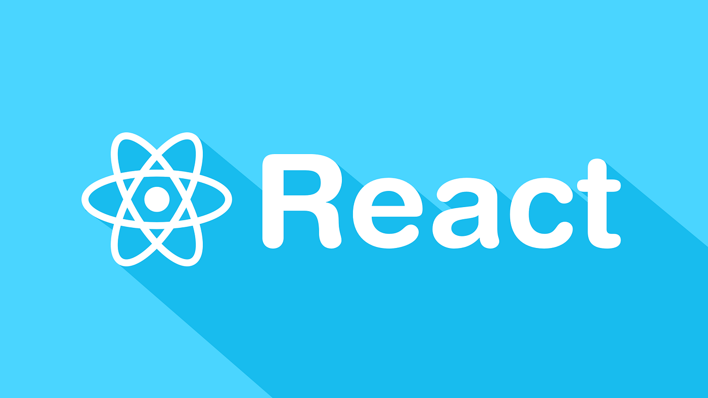

<div align="center">
  <h1>⚛️ Learning React Projects ⚛️</h1>
  
</div>

## 📂 My React Monorepo 📂

This repository houses a collection of individual React projects, each demonstrating different concepts and skills.

### 🚀 Projects Included 🚀

* **<ins>01-follow-twitter-card</ins>**: A neat React application showcasing a Twitter-style follow card component.
* **<ins>02-tic-tac-toe</ins>**: The classic Tic-Tac-Toe game, built with the power of React! 🕹️
* **<ins>03-mouse-follower</ins>**: A fun React experiment where a visual element playfully follows your mouse cursor. 🖱️

## 🛠️ Getting Started 🛠️

To get these projects running on your local machine, make sure you have Node.js and npm (or yarn) installed.

1.  **Clone the Repository 📲:**
    ```bash
    git clone https://github.com/Dacardonac/learning-react.git
    cd learning-react
    ```

2.  **Navigate to a Project 💻:**
    For each project you'd like to explore, navigate into its specific directory. For example:
    ```bash
    cd 01-follow-twitter-card
    ```

3.  **Install Dependencies ⬇️:**
    Once inside the project's folder, install the necessary packages using npm:
    ```bash
    npm install
    ```
    or with yarn:
    ```bash
    yarn install
    ```

4.  **Start the Development Server ⚡:**
    After the dependencies are installed, start the development server to see the project in action:
    ```bash
    npm run dev
    ```
    another option:
    ```bash
    npm start
    ```
    or with yarn:
    ```bash
    yarn start
    ```
    This will usually open the application in your web browser.

5.  **Explore Other Projects 📂:**
    Repeat steps 2-4 for the other exciting projects within this monorepo! Remember to navigate back to the root directory before entering a new project's folder.

## 💻 Technologies Used 💻

This project and its sub-projects are built using the following technologies:

* **Vite**: A fast build tool that provides a blazing-fast development experience.
* **HTML**: The standard markup language for creating web pages.
* **CSS**: Used for styling the HTML elements and providing the visual presentation.
* **React**: A JavaScript library for building user interfaces or UI components.
* **JavaScript (ES6+)**: The primary programming language used for the project's logic and interactivity.
* **JSX**: A syntax extension to JavaScript that allows writing HTML-like structures within JavaScript code.
* **ESLint**: A static code analysis tool used to identify and report on patterns found in ECMAScript/JavaScript code, with the goal of making code more consistent and avoiding bugs.
* **Conventional Commits**: A specification for making explicit commit messages, which helps in creating automated changelogs and understanding the evolution of the project.

## ✨ Contributing ✨

We welcome contributions! If you have ideas for improvements or find any issues, feel free to contribute. Here's how:

1.  Fork this repository.
2.  Create a new branch for your brilliant idea or bug fix.
3.  Make your changes and commit them thoughtfully.
4.  Push your changes to your forked repository.
5.  Submit a pull request for review.

## 📧 Contact 📧

If you have any questions, suggestions, or just want to say hi, feel free to open an issue or reach out! 🫱🏾‍🫲🏼
